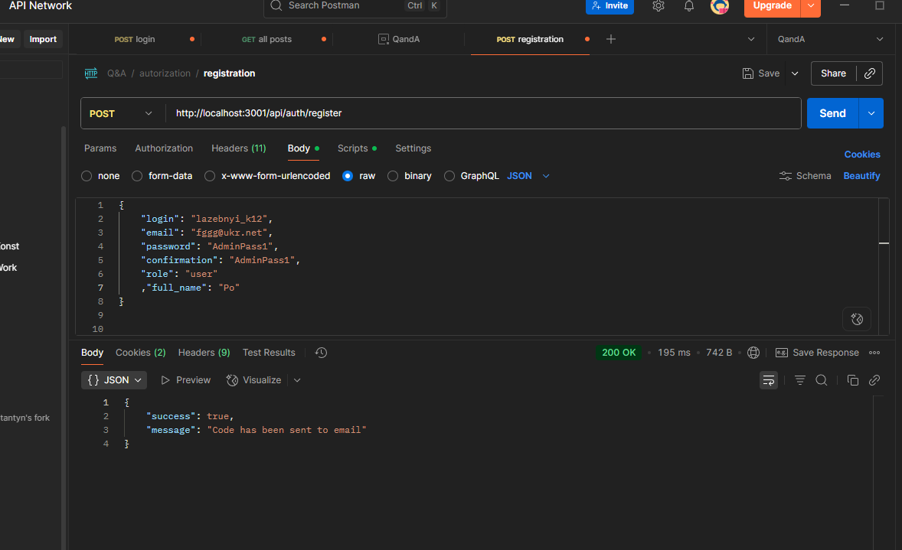

Usof

The backend application that provides set os endpoints and DB to implement
a basic functionality for "Q and A" web/mobile application. Based on Node.js express.

University project that can be useful in future real projects.

Main idea: Create own MVC

"dependencies": {
    "bcrypt": "^6.0.0",
    "cookie-parser": "^1.4.7",
    "date-fns": "^4.1.0",
    "express": "^4.18.2",
    "jsonwebtoken": "^9.0.2",
    "multer": "^2.0.2",
    "mysql2": "^3.14.1",
    "nodemailer": "^7.0.6"
}




## Prerequisites

To run this application, you need to have:

- [Node.js](https://nodejs.org/) installed (recommended LTS version).
- [MySQL](https://dev.mysql.com/downloads/) installed and running.


- [ukr.net IMAPAccess](https://wiki.ukr.net/ManageIMAPAccess) mail on @ukr.net
                      with IMAP Access that mailer uses to confirm registration


# ======⚠️ Note: This steps only needs to be done once during the initial setup:

# Clone the repository
# Get root directory and run 'npm install'
# Then you need to setup db.sql

1. Go to in the project to 'src\backend\sql';
2. You can (but not have to) change DB name, DB admin login and password in config.json and init.sql files
3. Run init.sql file script as a 'root' in order to crate the database.
   mysql -u root -p
   source ./init.sql
   After that, you can enter mySql as a q_a_db user (
       login: "q_a_db_admin"
       password: "securepass"
   ) by default;
4. Run source.sql file script to crate (recreate) tables.
  Now you have the first app admin:
    {
    "login": "first_admin",
    "password": "AdminPass1"
    {
5. If you need test data, run testData.sql 
    Now you have 5 users "user 1" - "user 5" password "userPassword1"
6. Set up the maler on @ukr.net  src/backend/models/mailconfig.json 
   (currently you can use my one)


==================================================================================

# To start the Usof app run 'npm start'
* You need to be in the root directory of project.
* Port 3001 must be free to use
# To stop press Ctrl + C and confirm


# Welcome to Usof!


[Documentation](http://docs.colyseus.io/)

## :crossed_swords: Usage

```
npm start
```

## Structure

- `main.js`: main entry point
- `src/backend/sql`: sql-scripts to create DB and connect
- `src/backend/routers` endpoints
- `src/backend/models`: models according to DB
- `src/backend/controllers`: classes which operate models.
- `src/backend/upload` directory to save avatars
- `package.json`:
    - `scripts`:
        - `npm start`: runs `node main.js`


## documentation
- [CBL Documentation — Usof Backend](https://docs.google.com/document/d/11299pRS8oeeXVaiBzp1ODIhN6sMs0kLcdI0TM-iWbgw/edit?usp=sharing)

## License

MIT

